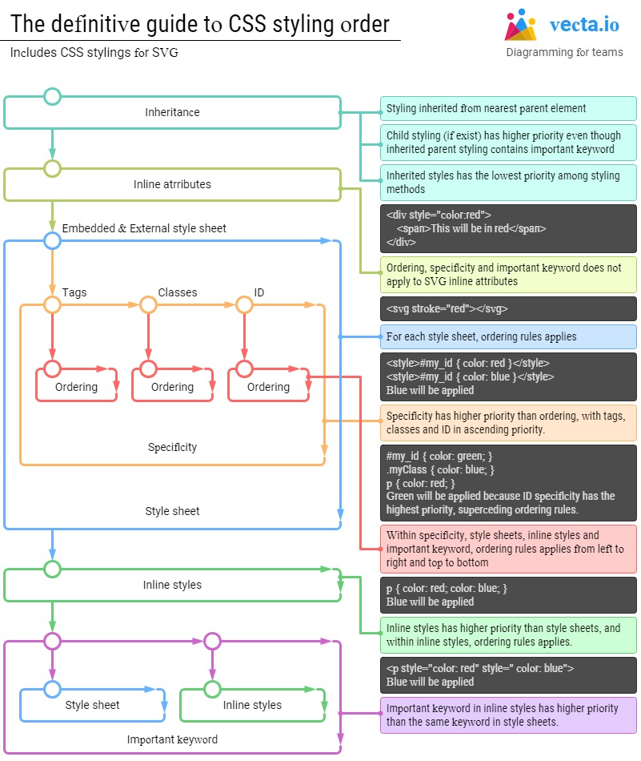

# CSS

Les feuilles de style en cascade (CSS) sont le code que vous utilisez pour styliser votre page web. Il indique au navigateur comment afficher le texte et les autres contenus que vous écrivez en HTML.

- Il existe trois façons principales d'appliquer un style CSS.
  * Vous pouvez appliquer des styles en ligne directement aux éléments HTML à l'aide de l'attribut style.
  * Vous pouvez également placer des règles CSS dans les balises de style d'un document HTML.
  * Vous pouvez écrire des règles CSS dans une feuille de style externe, puis faire référence à ce fichier dans le document HTML.

Préférez toujours la troisième option.

## Apprendre les bases

Vous pouvez rechercher les bases de CSS sur [MDN](https://developer.mozilla.org/fr/) pour apprendre les bases, ou accéder à [ici](https://developer.mozilla.org/fr/docs/Learn/Getting_started_with_the_web/CSS_basics) pour voir les bases de CSS dans la page MDN.

Vous pouvez également vous rendre à la page "Introduction to Basic CSS" dans [freecodecamp](https://learn.freecodecamp.org/responsive-web-design/basic-css).

### CSS Ordre de présentation (liste de priorité)

Excellent billet de Thomas Yip, fondateur de vecta.io, sur le sujet.
Vous pouvez le trouver [ici](https://vecta.io/blog/definitive-guide-to-css-styling-order).

L'image ci-dessous résume le sujet :



## Faire des mises en page

Vous pouvez rechercher la mise en page CSS sur [MDN](https://developer.mozilla.org/fr/) pour apprendre les bases de la mise en page, ou accéder à [ici](https://developer.mozilla.org/fr/docs/Learn/CSS/CSS_layout) pour la voir dans la page MDN.

### Positionnement

CSS traite chaque élément HTML comme sa propre boîte, ce qui est généralement appelé le modèle de boîte CSS. Les éléments au niveau du bloc commencent automatiquement sur une nouvelle ligne (comme les titres, les paragraphes et les divs), tandis que les éléments en ligne s'insèrent dans le contenu environnant (comme les images ou les travées). La disposition par défaut des éléments de cette manière est appelée le flux normal d'un document, mais CSS offre la propriété position qui permet de l'ignorer.

À noter :
Le positionnement vous donne beaucoup de souplesse et de pouvoir sur la présentation visuelle d'une page. Il est bon de se rappeler que, quelle que soit la position des éléments, le balisage HTML sous-jacent doit être organisé et avoir un sens lorsqu'il est lu de haut en bas. C'est ainsi que les utilisateurs souffrant de déficiences visuelles (qui utilisent des dispositifs d'assistance tels que des lecteurs d'écran) accèdent à votre contenu.

Cette explication est extraite de [freecodecamp](https://learn.freecodecamp.org/responsive-web-design/applied-visual-design/change-an-elements-relative-position/).
[freecodecamp](https://learn.freecodecamp.org/responsive-web-design/applied-visual-design/change-an-elements-relative-position/).

#### Relative

Lorsque la position d'un élément est définie comme relative, elle vous permet de spécifier comment CSS doit le déplacer par rapport à sa position actuelle dans le flux normal de la page. Elle est associée aux propriétés de décalage CSS de gauche ou de droite, et de haut ou de bas. Ces propriétés indiquent le nombre de pixels, de pourcentages ou d'ems qui doivent éloigner l'élément de sa position normale. L'exemple suivant éloigne le paragraphe de 10 pixels du bas de la page :

```
p {
  position: relative;
  bottom: 10px;
}
```

Le fait de changer la position d'un élément en position relative ne le retire pas du flux normal - les autres éléments qui l'entourent se comportent toujours comme si cet élément était dans sa position par défaut.

Cette explication est extraite de [freecodecamp](https://learn.freecodecamp.org/responsive-web-design/applied-visual-design/change-an-elements-relative-position/).

#### Absolute

Verrouille l'élément en place par rapport à son conteneur parent. Contrairement à la position relative, cette position retire l'élément du flux normal du document, de sorte que les éléments environnants l'ignorent. Les propriétés CSS de décalage (haut ou bas et gauche ou droite) sont utilisées pour ajuster la position.

L'élément sera verrouillé par rapport à son ancêtre le plus proche.

Cette explication est extraite de [freecodecamp](https://learn.freecodecamp.org/responsive-web-design/applied-visual-design/lock-an-element-to-its-parent-with-absolute-positioning).

#### Fixed

Verrouille l'élément en place par rapport à la fenêtre du navigateur. Contrairement à la position relative, cette position retire l'élément du flux normal du document, de sorte que les éléments environnants l'ignorent. Les propriétés de décalage CSS (haut ou bas et gauche ou droite) sont utilisées pour ajuster la position.

Les autres éléments ne se rendent plus compte de la position de l'élément, ce qui peut nécessiter des ajustements de la mise en page à d'autres endroits.

L'une des principales différences entre les positions "fixe" et "absolue" est qu'un élément dont la position est fixe ne bougera pas lorsque l'utilisateur fera défiler la page.

Cette explication est extraite de [freecodecamp](https://learn.freecodecamp.org/responsive-web-design/applied-visual-design/lock-an-element-to-the-browser-window-with-fixed-positioning).

### Floats

Les éléments flottants sont retirés du flux normal d'un document et poussés à la gauche ou à la droite de l'élément parent qui les contient. Cette propriété est généralement utilisée avec la propriété `width` pour spécifier l'espace horizontal nécessaire à l'élément flottant.

### Display

### Box Model

### CSS Grid

### Flex Box

## Media Queries

Vous pouvez effectuer une recherche sur les requêtes médias sur [MDN](https://developer.mozilla.org/fr/) pour apprendre les bases de la mise en page, ou accéder à [ici](https://developer.mozilla.org/fr/docs/Web/CSS/Media_Queries) pour voir la page MDN.